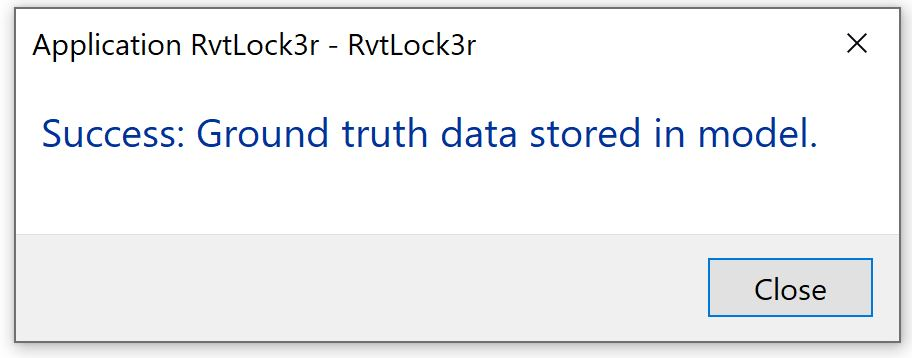
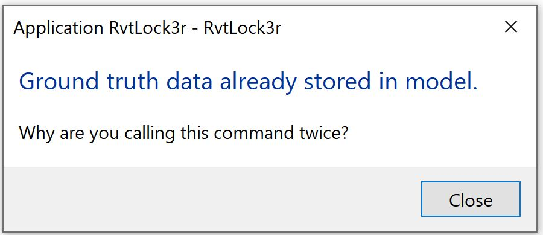
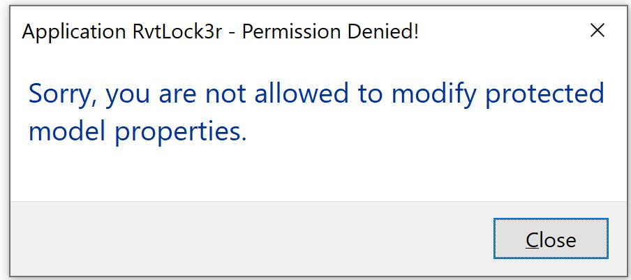

# RvtLock3r End User Help Documentation

([obsolete online draft](https://myshare.autodesk.com/:w:/g/personal/mikako_harada_autodesk_com/EXbZYeXRuZ9Kr_E5RH7u-h0B70L7kd2dDIjXjmaKM-7p8g?e=X5Bqp9))

<!--

to print PDF:

https://stackoverflow.com/questions/9998337/how-to-print-from-github

Here's a super simple solution:
Simply select all the text in the readme that you want to print, then print and choose "Only selected text".
This worked perfectly in Chrome (including images) and required no javascript or external sites or downloading or building software.

Nice! The option in Chrome is now called More settings -- Selection only.
It supports the formatting and doesn't require additional software or downloading the markdown file.

-->
 
Currently, Revit does not provide any built-in functionality to prevent the user from modifying parameter values.
RvtLock3r is a Revit add-in that you can use to verify whether parameter values have been changed. 

There are two types of end users for RvtLock3r: 

- Vendor: the provider of a set of elements with protected properties 
- Consumer: the consumer of these elements to create a model 

## Vendor 

The vendor defines the BIM elements properties they want to protect, also known as _ground truth_.

They make use of two external commands in the Revit ribbon tab _Lock3r_ in the panel _Validation_:  

- Ground Truth: this command generates the ground truth data and saves it in the Revit BIM. 
The Ground Truth command sets up the ground truth data and saves it in the BIM extensible storage. On successful setup, Revit provides a success dialog message below.

In case, the ground truth data set up was done successfully and the vendor unintentionally runs the same command. Below information dialog message is provided

- Validate: this command checks if any protected properties have been modified.

The validation command runs successfully and completes silently with no error if the model is in its original state and no protected parameter values have been modified.
In case any of the protected properties were modified, it returns an error code with a message and a list of element ids of the modified elements:

 <!-- 1189 -->

## Consumer 

The consumer makes use of the elements equipped with the veendor's read-only properties.
They can interact with the model however they wish.
The interaction is based on trust that they will not interfere with the protected properties.
The consumer will see a warning message from RvtLock3r in the following two scenarios:  

- Opening a model containing modified properties 
- Saving a model containing modified properties 

***Open:*** On opening a model containing modified properties from whichever source, an informational message is displayed to inform the user that the protected properties have been tampered with.
They may choose to proceed with the tampered model or contact the vendor for the original data.

 <!-- 915 -->

***Save:*** During interaction with the model, the consumer may intentionally or unintentionally modify a protected property.
In that case, when saving the model, an informational message is displayed informing the user that the property is read-only, and they are not allowed to modify it.

 <!-- 908 -->

 <!-- 632 -->

In case the consumer decides to close Revit with open unsaved modifications, a message is displayed asking whether to save or not:

 <!-- 907 -->
